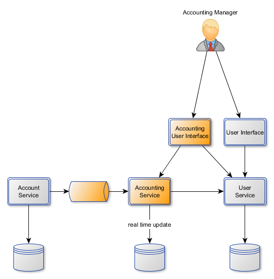

# Accounting Service

## User Story 1 : new user role

*As administrator of User Service *
*I want to be able to create accounting manager *
*In order to securize accounting service *

## User Story 2 : knowing bank state

*As an accounting manager *
*I want to see total amount of all bank's account *
*In order to know the state of the bank *

## User Story 3 : declarating operations

*As an accounting manager *
*I want every account's operations are declared as soon as possible *
*In order to be able to know the state of bank whenever *

