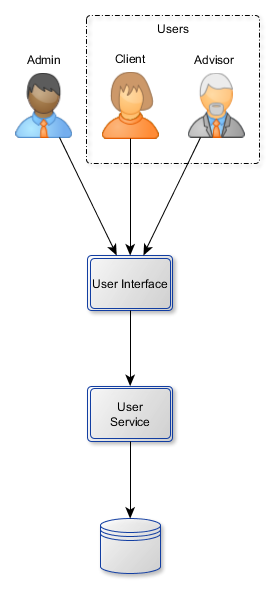

# User Service

## User Story 1 : creating users

*As administrator *
*I want to create a user and to assign him a single role *
*In order to add new users *

:speech_balloon: A user contains an id, a login, a password and a role ("administrator", "client", "advisor") 
Administrator is a user which is created when application is initialized

## User Story 2 : updating users

*As administror *
*I want to update a user *
*In order to let the database up to date *

*As a client or an advisor *
*I want to update my password *
*In order to ensure my connections *

## User Story 3 : cleaning users

*As administror *
*I want to remove a user *
*In order to clean up database *

## User Story 4 : checking password

*As a user *
*I want to check my password is correct *
*In order to ensure my connection *
