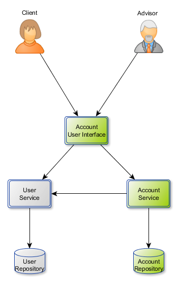

# Account Service

## User Story 1 : creating account

*As an advisor *
*I want to create a new account for a client *
*In order to allow him to save his money *

:speech_balloon: Account is linked to a single client and contain an account balance.

:speech_balloon: only advisor should be able to create accounts

## User Story 2 : reading account

*As an advisor *
*I want to read any client's account *
*In order to help clients *

*As a client *
*I want to read my account *
*In order to be aware of my account balance *

:speech_balloon: a client should not be able to read another client's account

## User Story 3 : deposit

*As a client *
*I want to make a deposit on my account *
*In order to save money *

:speech_balloon: a client should not be able to make deposit on another client's account

*As an advisor *
*I want to be able to make a deposit on any client's account *
*In order to help clients for their operations *

## User Story 4 : withdrawal

*As a client *
*I want to make a witdhrawal from my account *
*In order to retrieve some or all of my savings *

:speech_balloon: If the result of account balance is negative, then the withdrawal is forbidden.
:speech_balloon: a client should not be able to make deposit on another client's account

*As an advisor *
*I want to be able to make a witdhrawal on any client's account *
*In order to help clients for their operations *

## User Story 5 : overdraft

*As an advisor *
*I want to set an agreed overdraft for a client's account *
*In order to retrieve overdraft charges *

*As a client *
*I want to make a withdrawal from my account even if the result is negative *
*In order to face off an unexpected event *

:speech_balloon: When a client wants to make a withdrawal for which the resulting account balance would be negative, two rules have to be implemented:
1. if the account balance result is negative, then overdraft charges (agios) are applied on the result. For this example, we will consider 10% of overdraft charges. 
2. if this new result is less than -1000, then the operation is forbidden

## User Story 6 : operations

*As a client *
*I want to see all my operations *
*In order to see history of my valid operations *

:warning: Forbidden operations are not audited.
:speech_balloon: if this new result of withdrawal is negative and accepted, then 2 operations should be logged : withdrawal + overdraft charges
