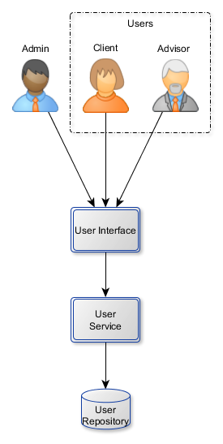

# User Service

## User Story 1 : creating users

*As an admin *
*I want to create users *
*In order to retrieve them in the future *

:speech_balloon: A user contains an id, a login, a password and a role ("administrator", "client", "advisor") 

Only admin are able to create and retrieve a user by its id

## User Story 2 : reading users

*As a user *
*I want to read only my own information *
*In order to check them *

Now a user should be able to retrieve its own information

## User Story 3 : updating users

*As an admin *
*I want to update any information of a user *
*In order to let the repository up to date *

## User Story 4 : changing own password

*As a user *
*I want to update my password *
*In order to ensure my connections *

## User Story 5 : cleaning users

*As an admin *
*I want to remove a user *
*In order to clean up repository *

## User Story 6 : checking password

*As a user *
*I want to check my password is correct *
*In order to ensure my connection *

## User Story 7 : encoding password

*As a user *
*I want my password is encoded *
*In order to ensure my connection *
